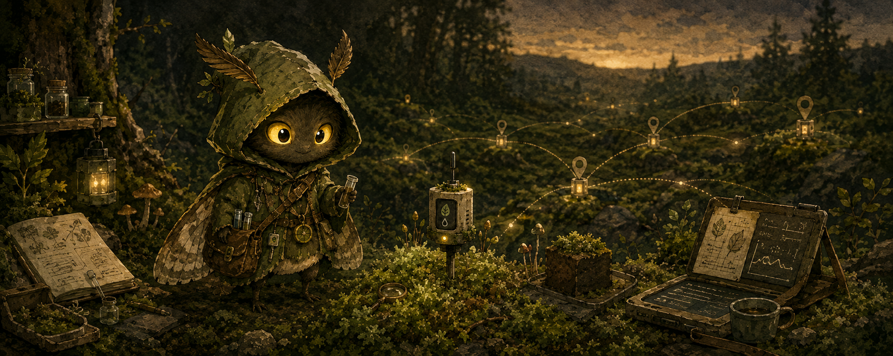

  

# Willkommen 🌿

Ich bin Kitty und baue privacy-first, Open-Source-Software mit Fokus auf lokale KI, Nachhaltigkeit und Selbstbestimmung.

## Aktuelle Feldnotizen

### Mooswacht

**Mooswacht** ist ein lokaler, datenschutzfreundlicher Open-Source-KI-Assistent für Zuhause, Alltag, Wissen, Naturbeobachtung und gemeinschaftliches Handeln.

Die Figur hinter Mooswacht heißt **Motte**.

Mooswacht verbindet:

- lokale KI statt Cloud-Zwang
- Open Source statt Blackbox
- Home Assistant und Smart Home
- Datenschutz und digitale Selbstbestimmung
- Tier- und Naturschutz
- Reparatur statt Neukauf
- Sensoren und Umweltbeobachtung
- Wissen, Bildung und Community

> Lokale KI. Offene Technik. Tiere schützen. Orte pflegen. Wissen teilen. Gemeinschaft stärken.

## Woran ich arbeite

- Mooswacht als lokalen Python-KI-Agenten
- Motte als persönliche Begleiterin und Projektfigur
- Dokumentation für ein größeres Mooswacht-Ökosystem
- Konzepte für App, Sensor-Kits, Mini-PCs, Community-Plugins und Reparaturservice

## Grundidee

Ich glaube, dass moderne Technik nicht automatisch Überwachung, Wegwerfgeräte und Konzernabhängigkeit bedeuten muss.

Technik kann auch lokal, offen, reparierbar, ressourcenschonend, naturverbunden und gemeinschaftlich sein.
